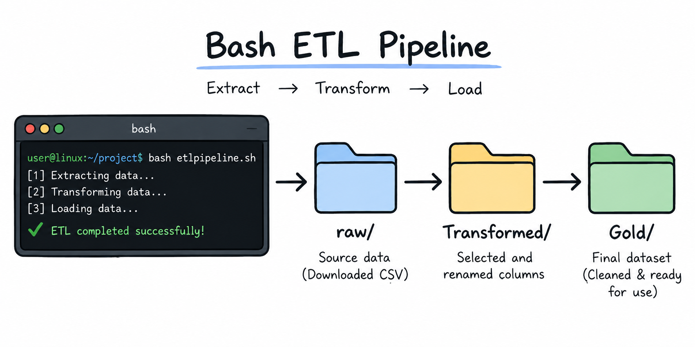

# Linux and Git Project

## The Problem

I joined CoreDataEngineers as a new Data Engineer and was tasked with working within a data infrastructure built on the Linux operating system.

One of my first responsibilities was to build a simple, reliable process for handling incoming data. The company receives data in CSV format, but before the data can be used downstream, it needs to be downloaded, cleaned, transformed, and organized into the appropriate storage locations.

My manager therefore asked me to build a Bash-based ETL pipeline that could automate this process.

The requirement was simple: **extract the data, transform only what is needed and saved to the Transformed folder, and lastly load the resulting dataset into the Gold layer.**

I also needed to schedule the ETL pipeline to run automatically every day at **12:00 AM** using Cron.
Lastly, I wrote a separate Bash script for moving CSV and JSON files.

- Git was used to version and document my work throughout the whole process.

---

## 2. How to Run
To replicate this project, clone the repository:

```bash
git clone <https://github.com/Lorreta-Anyika/DataEngineeringJourney>
```
- Navigate into the project directory: [cd Linux-git]
- Navigate to the ETL project: [cd question1_etl_shell_scripting]
- Run the Bash script: [./etlpipeline.sh]

The script downloads the raw dataset, transforms the required columns, and loads the transformed file into the Gold directory.

## 3. Design Decisions

A few decisions were made to make the scripts easier to maintain and less dependent on specific filenames or column positions.

### Environment Variable for the Data Source
```bash
Export raw_data_url="https://www.stats.govt.nz/assets/Uploads/Annual-enterprise-survey/Annual-enterprise-survey-2023-financial-year-provisional/Download-data/annual-enterprise-survey-2023-fin>
```
The dataset URL is stored as an environment variable rather than being hardcoded into the download command.

This makes it easier to update the data source without changing the main download logic.

### Use of `readonly`

After defining the URL, I used `readonly` to prevent the value from being accidentally changed during the execution of the script.

```bash
export raw_data_url="https://..."
readonly raw_data_url
```
### Dynamic Column Selection

For the ETL transformation, I selected columns based on their names rather than fixed column positions.

For example, instead of specifying that `Year` is column 1 and `Value` is column 9, the script searches the header for `Year`, `Value`, `Units`, and `variable_code` and stores their positions dynamically.

This means that if a new column is added to the source dataset or the existing columns are reordered, the transformation does not immediately break because it is looking for the required columns by name.

### Wildcards for File Management

The file-management script uses `*.csv` and `*.json` rather than specifying individual filenames.

This allows the script to work with one or multiple files without requiring changes to the script.

### Separation of Data Layers

The raw, transformed, and Gold data are kept in separate directories.

This preserves the original source data and makes the movement of data through the ETL process easier to follow.

## 4. Challenges and Lessons Learned

This project was not a straightforward process for me. I encountered several issues while trying to get the pipeline to work correctly, and debugging them became an important part of the learning process.

One of my first mistakes was adding spaces around `=` when assigning Bash variables. This caused Bash to interpret the assignment incorrectly. Fixing this helped me understand how strict Bash syntax can be.

I also initially tried to configure the Cron job from Git Bash on Windows. Since `crontab` was not available in my environment, I had to move the scheduling setup to my Contabo Linux server.

The biggest challenge I am still working through is the CSV transformation using `awk`.

I initially used:

```bash
awk -F"," ...
```
to separate the CSV columns. However, the dataset contains values with commas inside quotation marks, for example: "Sales, government funding, grants and subsidies"
The comma in this value is part of the actual data and should not be treated as a column separator. However, awk -F"," treats every comma as a delimiter, which causes some fields to be split incorrectly and affects the transformed output.

This has been one of the most important struggles in the project because the transformation can appear to work while still producing incorrect data.

I am therefore continuing to work on how to handle the CSV structure correctly while still respecting the requirement to use Bash scripting.

Another lesson was that checking whether a file exists is not the same as confirming that an operation succeeded. For example, a file from a previous run may still exist even if a new download fails. This made me more conscious of validating each stage of a pipeline rather than assuming that the presence of an output file means the process was successful.

Despite these challenges, the project has helped me understand that data engineering is not just about getting a script to run. It is also about asking whether the output is correct, reliable, and safe to use downstream.

## 5. Conclusion

This project gave me an opportunity to approach a simple data-engineering task from an infrastructure perspective.

I moved from manually handling files to building a Bash-based process that extracts, transforms, and organizes data, while also considering automation, maintainability, and version control.

More importantly, the challenges I encountered showed me that a pipeline is not successful simply because the script runs. The data must also be handled correctly, the process must be reliable, and the implementation should be maintainable.

This project strengthened my practical understanding of Linux, Bash scripting, Cron, file management, and Git, and gave me a stronger foundation for building more robust data pipelines.
